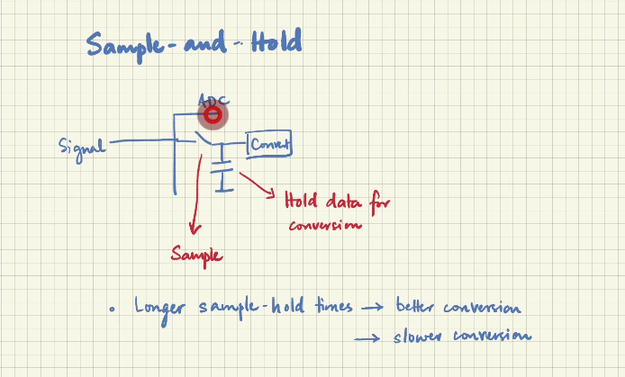

# Embedded C course

## Need to know
!Bitbanding

## Keywords
1. SoC - System on Chip
2. ELF - Executable and Linkable Format
3. RTC - Real Time Clock
4. MCU - Micro Controller Unit

## Video 3

- **Instruction set :** how does a code is understood by the hardware.

Microcontroller Families

1. AVR
  - Atmel: founder of AVR
    - Flash based.
    - 8-bit, extended later.

  - Adruino:
    - common boards.

2. PIC
  - From 1976 - Microchip Technology Inc.
  - Low cost.
  - used EEROM (Electronically Erasable Readonly Memory). To erase used UV light.

3. MSP 430
  - Texas Instruments.
  - Ultra Low Power Applications.
    - 0.1uA RAM retention.
    - 0.7uA RTClock operation.
  - Easy to use USB-power/debug.

4. ESP32
  - Espressif systems.
  - Low-cost, Many pheripherals, Bluetooth and wifi.
  - Tensilica XTensa ISA (Cadence).

> [!NOTE]
> This is main target base.
5. ARM
  - Advanced RISC Machine (originally "Acorn RISC Machine").
  - **RISC:** Reduced Instruction Set Computing.
  Cortex series Variants of 32-bit
    - **A - Application series :**
      - Memory management, full OS support.
      - used for Laptops and phones.
    - **R - Real-time :**
      - integrated memory with error correction.
    - **M - Microcontroller :**
      - No memory management, standalone only.
      - Low-power, embedded applications focus.

## Video 5
Basics of Embedded C - contains C topics.

- stdint.h for bit control size assignment of datatypes.
- Stack and Heap

- stack -> given to function
- Heap  -> Longer-lived and Global (Needs careful allocation).

## Video 6

##### Efficiency
- Resource: memory,CPU,IO bandwidth.
- speed: types of CPU Instruction.
- Power: Sleep states, power modes.

##### steps for Efficiency
- Don't use Standard INT use stdint library.
- Don't use redundant Global Variables in. Try to use dynamic local variables.
- Reduce the DYNAMIC Alloc and Dealloc.

##### Best practices
- Avoid Floating point computation.
- try using -O2 for speed improvement in compiling.
- try using -Os for producing small binary.

## Video 7: Memory management
***Static memory allocation***: We need to allocate the memory before the binary starts running.
- Avoid's fragmentation.
- used mainly at memory safety devices.
- No complex data structures.

And some more info on Dynamic memory allocation.

## Video 8: Bit manipulation

***Race condition***: Difference between time a value is read and when it is written/updated.
Eg: When we read a value and try to set it to another value another part of program changes the read value.

- ***Atomic manipulation :*** Read-modify-write guaranteed to be done a one operation. Requires hardware support on the CPU.
- ***Bit Bitbanding***: specific 1MB area is mapped to a 32MB address space.

- use volatile so that compiler doesn't remove some pin value setting.

## Video 9: Embedded C programming | three ways to blink an LED
use [wokwi](https://wokwi.com) a simulator

#### Blinking LED
```c

#define LED D13

void setup(){
  pinMode(LED, OUTPUT);
}

void loop(){
  digitalWrite(LED, HIGH);
  delay(1000);
  digitalWrite(LED, LOW);
  delay(1000);
}
```

- Here D13 is the pin defined by STM32 SDK which is address of the pin 
- setup function will set all the GPIO pins to required mode here we are setting D13 to output mode.
- void loop run endlessly
- digitalWrite function is using to set the pin signal to high and low

## Video 10: General purpose IO in Microcontroller
- CPU can't access anything outside itself.
- when we need more data we interface Memory to the CPU.
- for reading and writing we send Address and data over a BUS with read or write enable signal.

- when a GPIO - set to output => CPU IS DRIVING the pin.
- when a GPIO - set to input  => External circuit drives the pin.
- if modes are set incorrectly it may cause it to short-circuit.

> [!INFO]
> So the CPU will always set a GPIO pin to input when it is initialized.

- Mode selection is done using a register.
- There are certain pins that can acts as a Analog/Digital pin.

> [!WARNING]
> For a floating pin we can't find the voltage. And there is high impedence.
> to avoid the undefined behaviour we use pull-down resistor to make it defined.


#### HAL code
```c

void initGPIO(){
  GIO_InitTypedef GPIO_Config;

  GPIO_Config.Mode = GPIO_MODE_OUTPUT_PP;
  GPIO_Config.Pull = GPIO_NOPULL;
  GPIO_Config.Speed = GPIO_SPEED_FREQ_HIGH;

  GPIO_Config.Pin = LED_PIN;

  SET_BIT(RCC-> IOPENR, RCC_IOPENR_GPIOAEN);
  HAL_GPIO_Init(LED_PORT, &GPIO_Config);
}
```

## Video 11: GPIO Usage


### In-case of output

- When a CPU is 1.8V and sensor is 5V it may cause problems.
- So we need to know about the connection buffer.

### Similar to current case

- If the CPU can only output 5mA and we need to run a 10mA load, the buffer may short-circuit.
- Similarly if the sensor sends in 40mA and CPU can only sink 10mA that will damage the port.

### If we want to drive a motor

- We can only send 5mA but motor needs 100mA.

If we connect directly:

1. Either the motor spins at 5% speed
2. Or the CPU gets short-circuited

- For this we use a switch where the CPU controls the ON/OFF.
- The switch will deliver the large amount of current.

- [Push Button](###push-Button) are mechanical switches.
- [ESD Protection](#esd-protection) is required for the pins.
- Always check for ESD.

### Examples

- LED control — signaling, status
- Button inputs
- Driving relays
- Sensor interfacing
  - Analog / Digital
- Communication protocols
  - Bit Banging (software implementation)


### Push Button

It is a mechanical switch. When pressed and released it will bounce back.

- When debounced it cuts off the signal called **Debounce**.


### ESD Protection

ESD — Electro Static Discharge

This is the charge that builds up on a surface/body.

>[!Warning]
> Never touch the pins directly.

## Video 12: UART — Universal Asynchronous Receiver Transmitter

- Asynchronous — No shared clock.


- Always the idle state in UART is HIGH.
- First bit is LOW to say the data flow started.
- There is HIGH at the end to say that we are stopping data transfer.

### Parameters : 8N1 @ 9600

- 8 — number of data bits
- N — no parity bits
- 1 — one stop bit

9600 bits/second (Baud Rate)

### Disadvantages

- Speed lowers data rates
- Sensitive to baud-rate mismatch
- No shared clock — fails for clock drift
- Multi-master/multi-slave is not possible
- Frame overhead is significant
- Basic error detection, no correction
- Cable length decides the signal integrity

## Video 13: Datasheet reading
read the Datasheet's
1. [Red led](../datasheets/Datasheet-reading/red_led_1498852.pdf)
2. [STM32](../datasheets/Datasheet-reading/STM32-nucleo-64_DM00105823.pdf)
3. [stm32-microprocessor](../datasheets/Datasheet-reading/stm32c031c4.pdf)

## Video 14: Analog to Digital Conversion
- CPU works with binary system but most of the sensors work in Analog signal.
- So we sample the Analog signal at a discrete time using a ADC convertor.

- ADC range for N-bits => 0 - 2^N - 1

- Ideally
    Vmin = 0 && Vmax = 2^N -1
    Step size = (Vmin-Vmax)/2^N 

- Sampling interval = T

- then Sampling frequency (fs) = 1/T

- High fs means high detail

- At a point called ***Nyquist criteria*** there is no use of increasing the Sampling frequency (fs) we don't get reliable details.

STM ADC Settings
- **PRESCALER** - ADC clock which is a divided of main clock.
- **RESOLUTION** - 12bit, 10bit, etc...
- **ALIGNMENT** - left Alignment
              | 1 0 1 1 0 1 0 0 0 0 0 |
              | data         | padding|
            - right Alignment
              | 0 0 0 0 1 1 0 0 1 1 0 |
              | padding| data         |

### channels
- In Microcontroller there is only one ADC with multiple input channels. where it can only convertor one signal at a time but since the time taken is negligible we don't really have problem we can use software to mange the conversion of channels.

- ***scan*** : where we can tell to convert one then auto switch to other.
- ***continuous*** : After one conversion of one cycle start new cycle.
- ***Sequencer*** : where we define the sequence of conversion.

### Sample and Hold

for circuit where the signal changes very fast.
we allow signal to come in via a switch then it store the capacitor then open the switch where the signal stored in capacitor is released then it is converted.


#### wokwi Potentiometer control STM32

>[!NOTE]
> Pin ADC resolution is 10-Bit so max value is 2^10 = 1024-1 

```c
#define ANALOG_PIN PA0
#define BAUD_RATE 9600

void setup(){
  Serial.print("Baud Rate: ");
  Serial.println(BAUD_RATE);
  Serial.begin(BAUD_RATE);

  Serial.println("Setting Analog pin to INPUT MODE");
  pinMode(ANALOG_PIN, INPUT);
}

void loop(){
  delay(1000);

  float adcValue = analogRead(ANALOG_PIN);
  Serial.print("ADC value: ");
  Serial.print(adcValue);

  Serial.print("Analog percentage: ");
  Serial.println(adcValue/1023);
}

```

## Video 15: Pulse width modulation
- there is noise in any voltage or current so when we use steps in the pwm we need to take account of the noise in the resolution of the system.

Eg:
Voltage range 0 -> 3.3
- i want 10 steps then resolution is 0.33 volts but there is noise of x% which is the result of factors such as temperature, resistance, emf, etc.

```c
void setupPWM(){
  TIMER->PRESCALER = 16;
  TIMER->PERIOD = 1000;

  // Duty cycle of 50%
  TIMER->COMPARE = 500;

  TIMER->MODE = PWM_MODE;

  TIMER->START();
}
```

## video 16: Clocking in Microcontroller
- High clock speed is desirable as more commute is possible.
- High clock speed = High power consumption.

- RTC is a real time most common clock speed is 32MHz.

#### Clock sources 
- Internal RC oscillators.
  - MCU can run without external source.
  - Not very accurate with 1% to 5 % error.
- External crystal oscillators.
  - high accuracy.
  - Low drift & temperature sensitivity.
- Phase Locked Loops.
  - frequency conversion.
  - up scale and down scale majorly up scaled.
- clock division.

## Video 17: Timers
- clock source
- mode
- period & prescaler
- Interupts

- ***watchdog***: it is a special timer that is separate from the circuit and it should occationaly hit zero if not the system should **pat** the watchdog that means reset. if not it will reset the whole system.
- watchdog timer should be set a long interval.

## Video 18: Communication protocols
- to connect all the peripherals to the MCU. we use a Communication protocols to interconnect all of the to a single bus/interface.

## Video 19: Parallel communication
- once there used to be a lot of parallel communication but due to some problem paralle communication is reduced.
- 1. Signal integrity
    - a. Cross talk: where due to switching the EMF of one line interfere with the other line/
    - b. Timing skew: where there is a delay of switching between the parallel lines.

- more wire more complex

## Video 20: Serial communication
- fewer wires. So, less complex,cost
- No crosstalk or timing skew.

### types of serial communication
1. UART
2. SPI
3. [I2C](../communication_protocols/I2C.md)
4. 1-wire protocol
5. [USB](../Electronics/USB.md)

#### SPI - Serial Peripheral Interface

> [!NOTE]
> Useful for small number of slaves maybe 3/4.
> to avoid this there is something called daisy chain method.
> But daisy chain creates latency problems and complex problems.

- Synchronous, Serial, short-distance. protocol.
- Full duplex Master-slave architecture with select lines.
[[../communication_protocols/SPI.md]]


#### 1-wire protocol
- Similar to I2C.
- Addressing Similar to I2C, single master.
- low data rate
- half duplex


